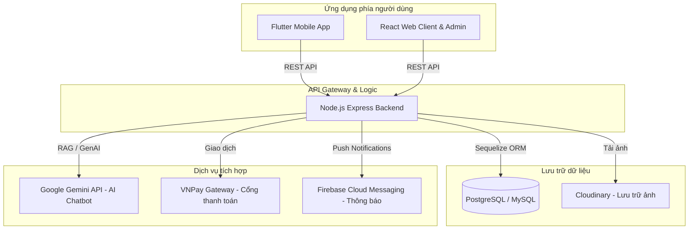

# Grocery Store - Hệ Thống Quản Lý & Mua Sắm Nông Sản, Thực Phẩm Trực Tuyến

> Một giải pháp toàn diện hỗ trợ quản lý cửa hàng bách hóa và mua sắm trực tuyến đa nền tảng, tích hợp Trợ lý ảo thông minh (AI Chatbot) và cổng thanh toán trực tuyến.

---

## 📌 Tổng Quan Hệ Thống

Dự án bao gồm 3 phân hệ chính được phát triển đồng bộ:
1. **Backend**: API server viết bằng **Node.js (Express)**, sử dụng **Sequelize ORM** để tương tác với cơ sở dữ liệu (PostgreSQL/MySQL), tích hợp cổng thanh toán VNPay, Firebase Admin SDK (FCM) và Google GenAI SDK (Gemini 2.0).
2. **Web Frontend**: Giao diện quản trị (Admin Dashboard) và mua sắm cho người dùng được xây dựng bằng **React (TypeScript, Vite)** và **Ant Design (Antd)**.
3. **Mobile App**: Ứng dụng dành cho khách hàng trên điện thoại di động phát triển bằng **Flutter**, hỗ trợ đặt hàng nhanh chóng, đăng nhập Google, đẩy thông báo thời gian thực và chat với AI trợ lý.



---

## ✨ Các Tính Năng Nổi Bật

### 📱 1. Phân hệ Khách hàng (Mobile App & Web Client)
* **Mua sắm thông minh**: Duyệt sản phẩm theo danh mục, tìm kiếm nâng cao, bộ lọc giá và độ phổ biến.
* **Giỏ hàng & Đặt hàng**: Quản lý giỏ hàng trực quan, áp dụng mã giảm giá, tính toán chi phí vận chuyển.
* **Thanh toán tích hợp**: Thanh toán linh hoạt qua tiền mặt (COD) hoặc thanh toán trực tuyến qua cổng **VNPay Sandbox**.
* **Đăng nhập đa phương thức**: Hỗ trợ đăng nhập truyền thống và đăng nhập nhanh bằng **Google Sign-In**.
* **Nhận thông báo thời gian thực**: Trạng thái đơn hàng được cập nhật tức thì tới người dùng thông qua **Firebase Cloud Messaging (FCM)** và **Flutter Local Notifications**.
* **Đọc tin tức & Đánh giá**: Cập nhật thông tin nông sản, mẹo nhà bếp và đánh giá chất lượng sản phẩm.

### 🤖 2. Trợ lý AI Thông Minh (RAG Chatbot với Gemini 2.0)
* Tích hợp **Gemini 2.0 Flash API** qua thư viện `@google/genai`.
* Áp dụng mô hình **RAG (Retrieval-Augmented Generation)** kết hợp cơ sở tri thức nội bộ (`knowledge.json`) giúp trả lời chính xác thông tin sản phẩm, cách chế biến, chính sách cửa hàng và gợi ý mua sắm thông minh.
* Quản trị viên có thể cập nhật cơ sở tri thức (Knowledge Base) trực tiếp thông qua giao diện Admin Web (Thêm, Xóa, Cập nhật thông tin RAG).

### 💻 3. Trang Quản Trị (Admin Dashboard - Web)
* **Báo cáo & Thống kê**: Theo dõi doanh thu, số lượng đơn hàng, thanh toán gần đây.
* **Quản lý Sản phẩm & Danh mục**: Thêm mới, cập nhật thông tin sản phẩm, tải ảnh lên **Cloudinary**, quản lý số lượng tồn kho.
* **Quản lý Đơn hàng & Thanh toán**: Cập nhật trạng thái đơn hàng (Đang xử lý, Đang giao, Đã giao), phê duyệt trạng thái thanh toán và tự động gửi thông báo (Push Notification) đến App của người dùng.
* **Quản lý người dùng & Tin tức**: Quản trị tài khoản khách hàng, nhân viên và viết tin tức bài đăng.
* **Quản lý RAG Knowledge Base**: Tùy chỉnh kho dữ liệu kiến thức cho chatbot.

---

## 🛠️ Công Nghệ Sử Dụng

### Backend
* **Runtime**: Node.js v18+
* **Framework**: Express.js
* **Database & ORM**: Sequelize ORM, hỗ trợ linh hoạt PostgreSQL (Supabase) và MySQL (Docker Compose)
* **Đăng nhập & Bảo mật**: JWT (JSON Web Tokens), Bcrypt.js, Express-rate-limit
* **Lưu trữ đám mây**: Cloudinary API (Quản lý hình ảnh sản phẩm)
* **Tích hợp bên thứ ba**: Firebase Admin SDK, Google GenAI SDK (Gemini), VNPay API

### Web Frontend
* **Framework**: React 19 + TypeScript (Vite)
* **UI Library**: Ant Design (Antd)
* **HTTP Client**: Axios
* **Routing**: React Router DOM v7
* **Quản lý trạng thái & Tiện ích**: Day.js, React Toastify

### Mobile App (Flutter)
* **Framework**: Flutter SDK (Dart)
* **State Management**: Provider
* **Storage**: Flutter Secure Storage (Lưu trữ JWT & bảo mật)
* **Notifications**: Firebase Core, Firebase Messaging, Flutter Local Notifications
* **Authentication**: Google Sign In

---

## 📂 Cấu Trúc Thư Mục Dự Án

```text
GroceryStore/
├── backend/            # Mã nguồn API Server (NodeJS)
│   ├── src/
│   │   ├── config/     # Cấu hình database, cloudinary, vnpay
│   │   ├── controllers/# Xử lý logic API (Admin, Order, Product...)
│   │   ├── middleware/ # Xác thực JWT, phân quyền, giới hạn request
│   │   ├── models/     # Định nghĩa các model Sequelize (User, Product, Order...)
│   │   ├── routes/     # Định nghĩa các endpoint API
│   │   ├── utils/      # Các hàm bổ trợ (Gửi notification, helper...)
│   │   └── app.js      # File chạy chính của server
│   ├── .env.example    # Mẫu cấu hình biến môi trường cho backend
│   ├── Dockerfile      # Cấu hình đóng gói container API
│   └── docker-compose.yml # File compose khởi chạy DB MySQL & Backend
│
├── frontend/           # Mã nguồn trang Web khách hàng & Admin (React)
│   ├── src/
│   │   ├── components/ # Các component giao diện dùng chung
│   │   ├── contexts/   # React Contexts (Auth, Cart...)
│   │   ├── layouts/    # Bố cục giao diện (AdminLayout, ClientLayout)
│   │   ├── pages/      # Các trang (Admin, Home, Cart, Product, Order...)
│   │   ├── services/   # Gọi API backend (Axios config)
│   │   └── main.tsx    # File khởi chạy React
│   └── index.html
│
└── app/                # Mã nguồn ứng dụng di động cho khách hàng (Flutter)
    ├── assets/         # Tài nguyên ảnh, icon và file cấu hình .env
    ├── lib/
    │   ├── core/       # Cấu hình chung, định tuyến, theme
    │   ├── data/       # Model dữ liệu và dịch vụ API kết nối Backend
    │   ├── presentation/
    │   │   ├── providers/# Quản lý trạng thái ứng dụng (Auth, Cart, Product)
    │   │   ├── screens/  # Các màn hình ứng dụng (Home, Chatbot, Orders...)
    │   │   └── widgets/  # Các widget giao diện tái sử dụng
    │   └── main.dart   # File khởi chạy ứng dụng Flutter
```

---

## 🚀 Hướng Dẫn Cài Đặt & Khởi Chạy

### 1. Cấu hình biến môi trường (`.env`)

#### Backend (`backend/.env`):
Tạo file `.env` tại thư mục `backend/` dựa trên mẫu sau:
```env
PORT=3000
JWT_SECRET=your_jwt_secret_key
JWT_EXPIRES=15m
JWT_REFRESH_EXPIRES=7d
BCRYPT_SALT_ROUNDS=10

# Database (PostgreSQL hoặc MySQL)
DB_NAME=postgres
DB_USER=postgres
DB_PASS=your_db_password
DB_DIALECT=postgres
DB_HOST=localhost
DB_PORT=5432

# Cloudinary Config
CLOUD_NAME=your_cloudinary_name
API_KEY=your_cloudinary_api_key
API_SECRET=your_cloudinary_secret

# VNPay Sandbox Config
VNPAY_TMN_CODE=your_vnpay_tmn_code
VNPAY_HASH_SECRET=your_vnpay_hash_secret
VNPAY_URL=https://sandbox.vnpayment.vn/paymentv2/vpcpay.html
VNPAY_RETURN_URL=http://localhost:3000/payment/vnpay_return

# AI Chatbot Config
GEMINI_API_KEY=your_gemini_api_key

# Google Authentication
GOOGLE_WEB_CLIENT_ID=your_google_client_id
```

#### Flutter App (`app/.env`):
Tạo file `.env` tại thư mục `app/` để cấu hình địa chỉ IP máy chủ API:
```env
API_URL=http://<IP_MAY_TINH_CUA_BAN>:3000
```

---

### 2. Cài đặt & Khởi chạy Backend

#### Cách 1: Chạy trực tiếp trên máy local
Yêu cầu đã cài đặt Node.js và có cơ sở dữ liệu sẵn.
```bash
cd backend
npm install

# Tạo/Khôi phục DB từ file backup-mysql.sql nếu dùng MySQL
# Hoặc Sequelize sẽ tự tạo các bảng khi khởi chạy ứng dụng

# Chạy ở chế độ Development (Nodemon)
npm run dev
```

#### Cách 2: Chạy thông qua Docker Compose (Khuyên dùng)
Khởi chạy đồng thời cả API Server (Backend) và React Web (Frontend) kết nối tới cơ sở dữ liệu Supabase trực tuyến.
```bash
cd backend
docker-compose up --build -d
```

---

### 3. Cài đặt & Khởi chạy Web Frontend

```bash
cd frontend
npm install

# Khởi chạy dev server (Vite)
npm run dev
```
Truy cập vào giao diện web mặc định tại địa chỉ: `http://localhost:5173`.

---

### 4. Cài đặt & Khởi chạy Flutter App

Yêu cầu đã cài đặt **Flutter SDK** và cấu hình thiết bị ảo (Emulator) hoặc thiết bị thật kết nối qua USB.

```bash
cd app
flutter pub get

# Khởi chạy ứng dụng
flutter run
```

> 💡 **Lưu ý về Firebase Notification**: Để tính năng đẩy thông báo (Push Notifications) và đăng nhập Google hoạt động chính xác trên thiết bị di động, bạn cần thay thế file `google-services.json` trong thư mục `app/android/app/` và file cấu hình tương ứng trên iOS bằng cấu hình từ tài khoản Firebase cá nhân của bạn.

---

## 🔒 Bản quyền & Giấy phép
Dự án được thực hiện bởi tác giả **TranDien**. Vui lòng ghi rõ nguồn khi tham khảo hoặc tái sử dụng mã nguồn.